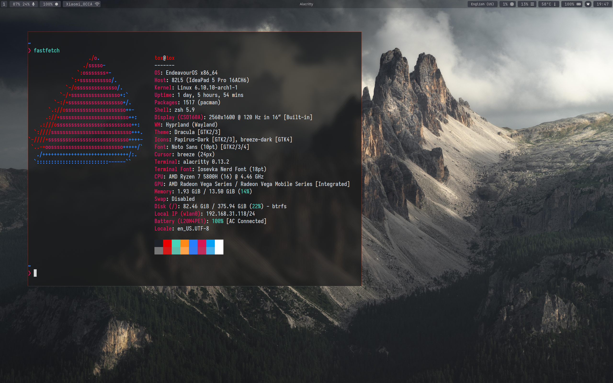
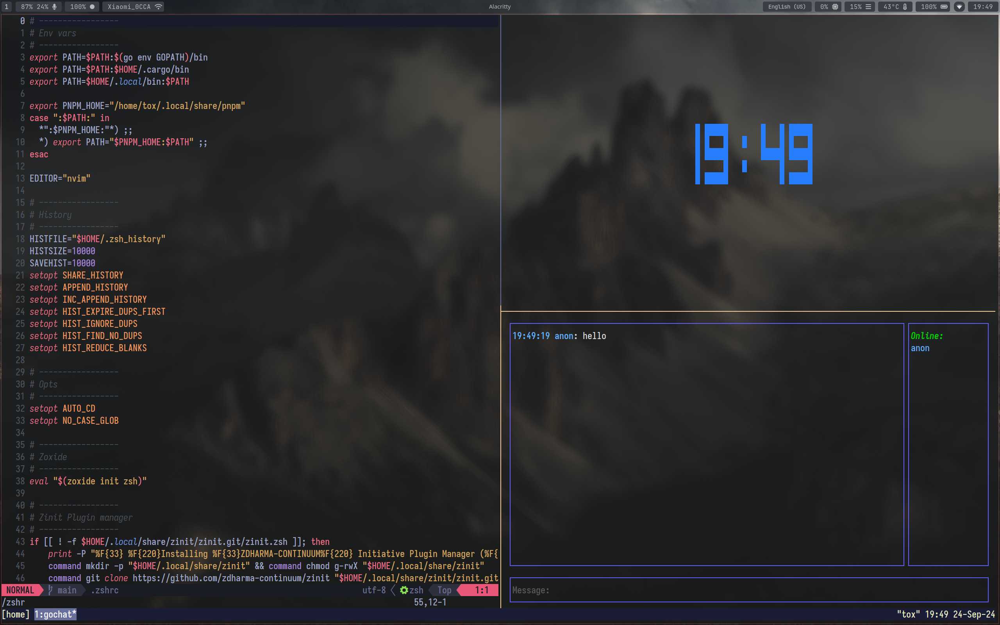

# Dotfiles for Arch Linux and Hyprland

Contains installation script and should work out of the box on fresh installation of Arch

Neovim config can be found [here](https://github.com/m1kkY8/nvimrc)
